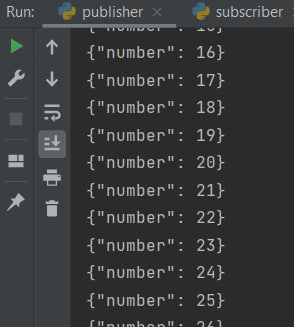
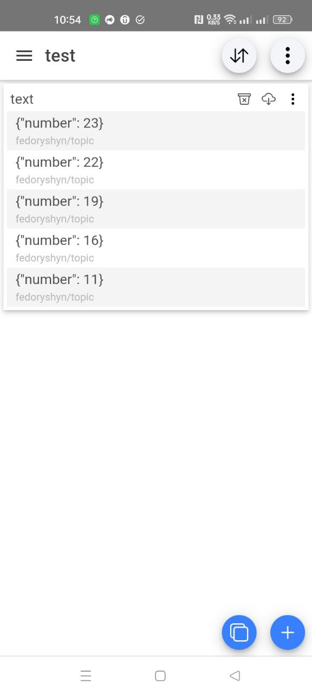
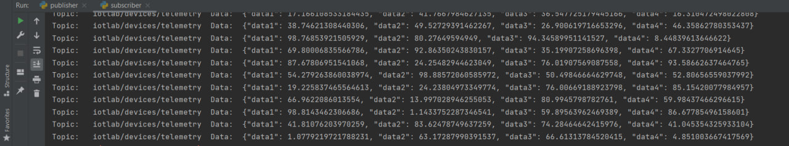
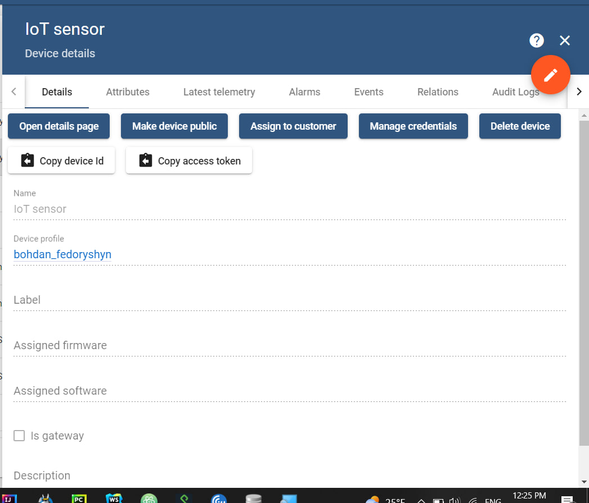
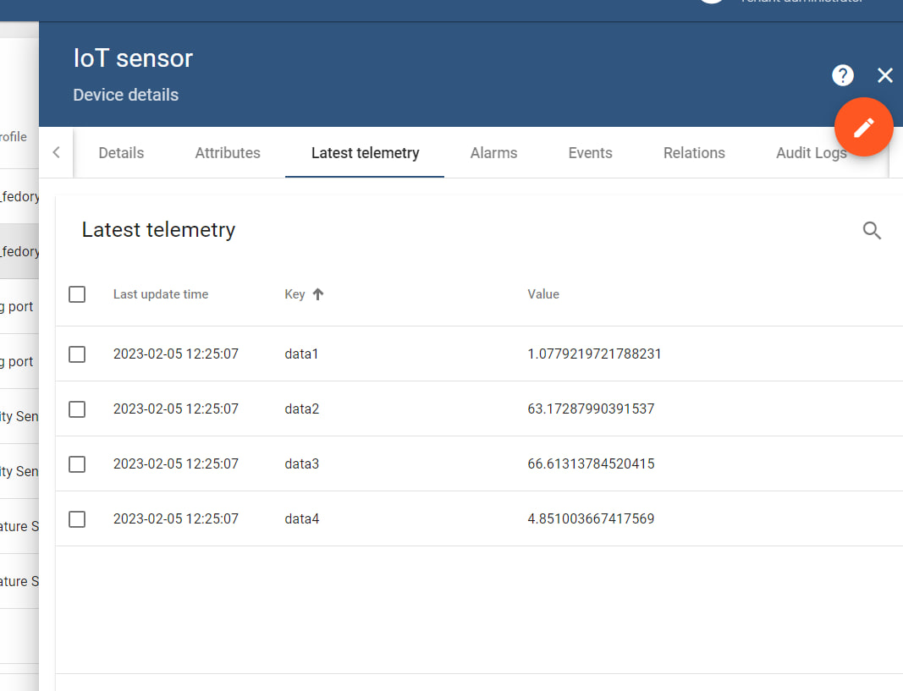
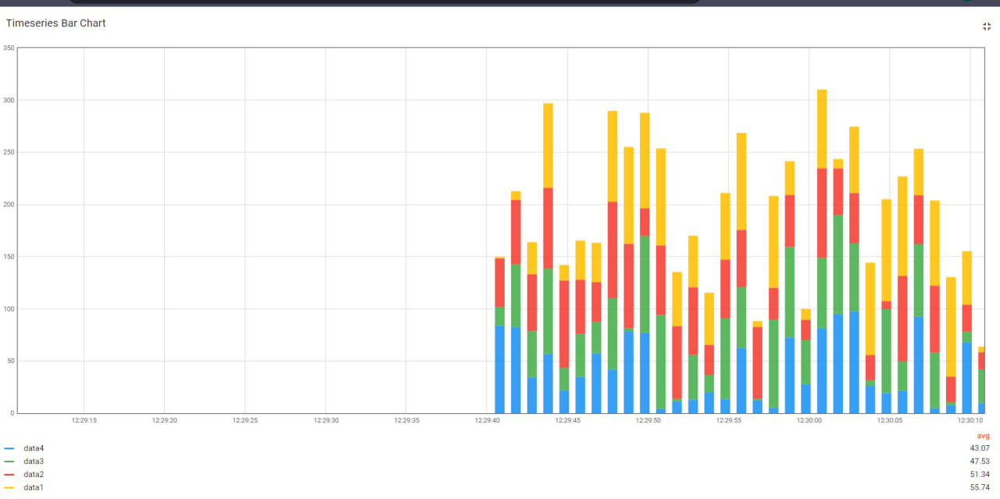
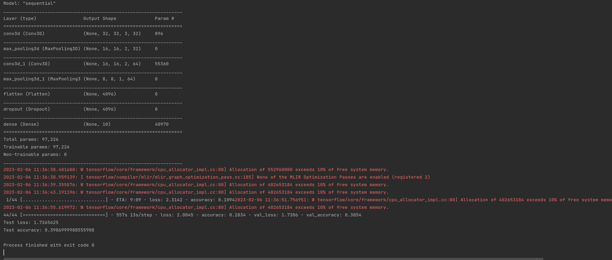

<h1> Fedoryshyn Bohdan ІТПА-11 НУ  </h1>

<h2> Лабораторна робота №1</h2>
<h3> MQTT </h3>

Використовуючи бібліотеку paho.mqtt генерував повідомлення, та відправляв їх в топік:

Використовуючи android додаток Iot MQTT Panel - підписався на topic: **fedoryshyn/topic** на ресурсі [test.mosquitto.org](https://test.mosquitto.org)\
Та отримував повідомлення:

 

<h2> Лабораторна робота №2</h2>

<h3> Things board </h3>

Використовуючи бібліотеку paho.mqtt генерував рандомні числа від 1 до 100, та відправляв їх в топік в Json форматі.

 

Створив профіль bohdan_fedoryshyn та Iot sensor  на ресірсі [things board](https://demo.thingsboard.io/)

 

Отримував повідомлення з топіка:

 

Використовуючи дашборд панель візуалізував дані повідомлення у вигляді графіку:

 

<h2> Лабораторна робота №3</h2>
<h3> Нейроні мережі </h3>

 Використовуючи бібліотеки:
 * numpy 
 * tensorflow
 * keras

провів навчання нейронної мережі на розпізнавання картинок 10-ти видів, а також провів тест:

 

